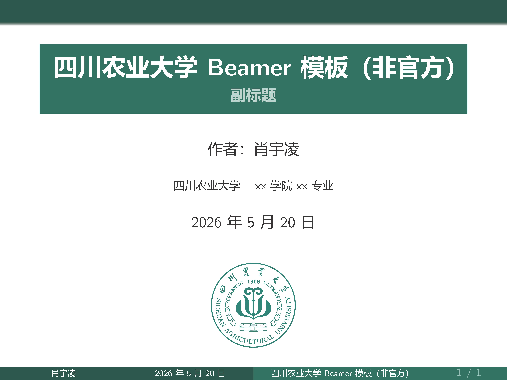
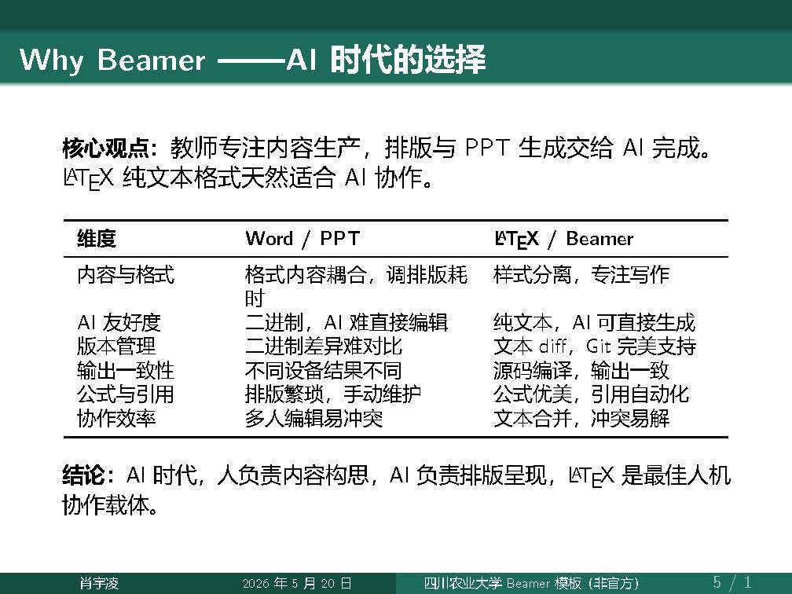
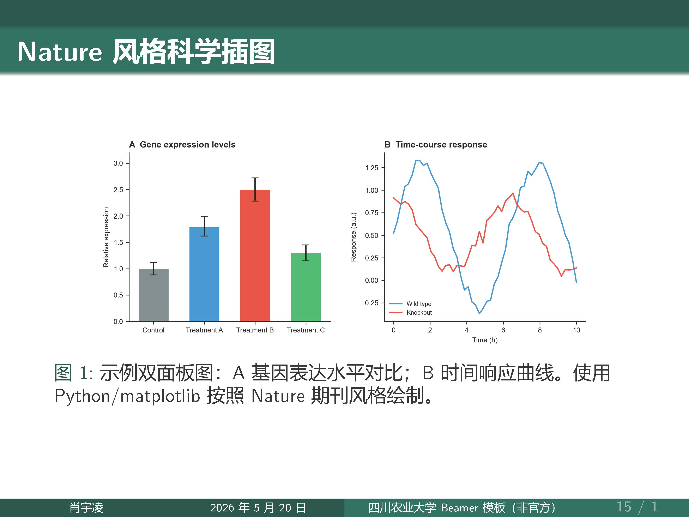

# SICAU Beamer Theme /四川农业大学 LATEX PPT 模板/ 四川农业大学 Beamer 模板

[](https://www.overleaf.com)

A non-official Beamer presentation template for **Sichuan Agricultural University (SICAU)**, designed for academic reports, thesis defense, and course presentations.

四川农业大学非官方 Beamer 学术汇报模板，适用于学术报告、论文答辩、课程展示等场景。

---

## Features / 功能特色

- **School color scheme** — Primary & accent colors extracted from the SICAU logo (RGB 28,108,92)
- **Bilingual support** — Full CJK support via `ctex` + `XeLaTeX`, suitable for both Chinese and English content
- **Clean design** — Minimalist layout with clear hierarchy
- **Pre-built blocks** — `block`, `exampleblock`, `alertblock` with school-color styling
- **Nature-style figure demo** — Built-in scientific figure example generated with Python/matplotlib
- **Easy to customize** — All colors and fonts centralized in `SICAUBeamer.sty`

**校色主题** — 主色/辅助色全部取自校徽色系（RGB 28,108,92）
**中英文兼容** — 通过 `ctex` + `XeLaTeX` 完美支持中英文混排
**简洁设计** — 清晰的信息层级，适合学术展示
**内置 block** — 普通框/举例框/警告框，校色统一
**科学插图示例** — 附带 Python/matplotlib 绘制的 Nature 风格双面板图
**易于定制** — 颜色字体集中在 `SICAUBeamer.sty`，一处修改全局生效

---

## Quick Start / 快速开始

### Requirements / 编译要求

| Dependency | Notes |
|-----------|-------|
| XeLaTeX | Required for CJK support |
| `ctex` | Chinese typesetting package |
| `SICAUBeamer.sty` | Included in this repo |
| Noto Sans CJK SC / Source Han Sans SC / Microsoft YaHei | One CJK font installed |

### Compile / 编译

```bash
xelatex SICAU_Beamer.tex
```

Or use your preferred LaTeX editor (TeXstudio, VS Code + LaTeX Workshop, Overleaf, etc.).

---

## File Structure / 文件结构

```
├── SICAU_Beamer.pdf       # Compiled PDF / 编译预览
├── SICAU_Beamer.tex       # Main document / 主文档
├── SICAUBeamer.sty        # Theme package / 主题包
├── pic/
│   ├── SIACU_logo.png     # School logo / 校徽
│   ├── watermark.png      # Watermark / 水印
│   ├── nature_demo.png    # Demo figure / 示例科学插图
│   ├── SICAU_Beamer_页面_01.jpg  # Preview / 预览页
│   ├── SICAU_Beamer_页面_05.jpg  # Preview / 预览页
│   └── SICAU_Beamer_页面_17.jpg  # Preview / 预览页
└── README.md
```

---

## Preview / 预览







[📄 Download compiled PDF](SICAU_Beamer.pdf)

---

## Customization / 自定义

Edit `SICAUBeamer.sty` to change:

修改 `SICAUBeamer.sty` 即可调整：

```latex
% School colors / 校色
\xdefinecolor{sicau}{RGB}{28, 108, 92}          % primary / 主色
\xdefinecolor{sicauLight}{RGB}{72, 142, 128}     % light / 浅色
\xdefinecolor{sicauVeryLight}{RGB}{188, 210, 204}% very light / 辅助色
\xdefinecolor{sicauDark}{RGB}{18, 78, 64}        % dark / 深色
```

---

## License / 许可

This template is provided as-is for educational and academic use.

本模板仅供学术和教育用途，免费使用。
